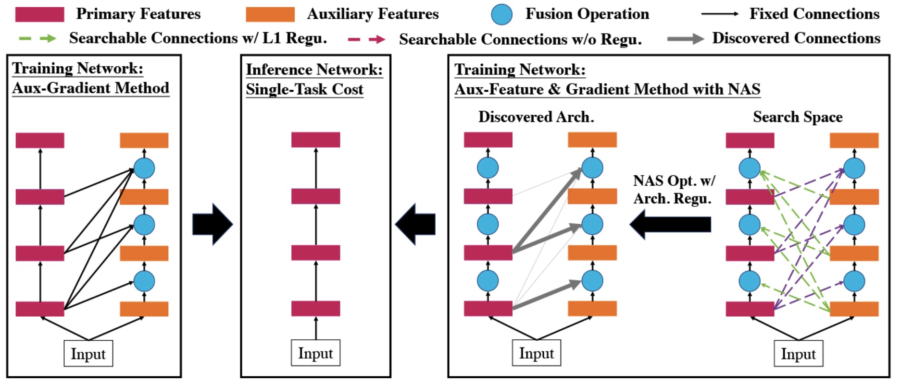

# Aux-NAS: Exploiting Auxiliary Labels with Negligibly Extra Inference Cost
Official PyTorch Implementation of [Aux-NAS](https://arxiv.org/abs/2405.05695).

Please refer to our paper for more technical details:
> Yuan Gao, Weizhong Zhang, Wenhan Luo, Lin Ma, Jin-Gang Yu, Gui-Song Xia, Jiayi Ma. Aux-NAS: Exploiting Auxiliary Labels with Negligibly Extra Inference Cost, International Conference on Learning Representations (ICLR), 2024. [[arXiv]](https://arxiv.org/abs/2405.05695)



If this code is helpful to your research, please consider citing [our paper](https://arxiv.org/abs/2405.05695) by:

```
@inproceedings{auxnas2024,
    title={Aux-NAS: Exploiting Auxiliary Labels with Negligibly Extra Inference Cost},
    author={Yuan Gao and Weizhong Zhang and Wenhan Luo and Lin Ma and Jin-Gang Yu and Gui-Song Xia and Jiayi Ma},
    year={2024},
    booktitle = {International Conference on Learning Representations (ICLR)}
}
```

## Setup
Install the necessary dependencies:
```sh
$ pip install -r requirements.txt
```

## Dataset & Checkpoints
Follow the instruction [here](https://github.com/ethanygao/NDDR-CNN) to prepare the dataset. Alternatively, download the preprocessed dataset [here](https://1drv.ms/u/c/7a98ceef6d290667/EQRZt_HaVlFLo3bgsYvnsKgBcxMgv0vuZY5eAJIN_gHSQQ?e=ICjEBf) and unzip it in the `Aux-NAS` folder.

Train the single task weights following the instruction below. Alternatively, download the converted PyTorch models from [here](https://1drv.ms/u/c/7a98ceef6d290667/EeoehlLd8l1KoEZGEVpiDb4Bixwo0dl8rKe6OFNL1yYSgw?e=8lfi5F) and unzip it in the `Aux-NAS` folder.

When you are all set, you should have the following file structure:
```
Aux-NAS/datasets/nyu_train_val
Aux-NAS/ckpts/single_task/normal
Aux-NAS/ckpts/single_task/seg
```

## Training & Evaluation
The configuration files for different experiments are provided in the `configs` directory.

### Single Tasks:
```sh
$ CUDA_VISIBLE_DEVICES=0 python train.py --config-file configs/config_normal2.json   # normal
$ CUDA_VISIBLE_DEVICES=0 python train.py --config-file configs/config_seg2.json      # seg
```

### Aux-Head (Simple MTL with Fully Shared Backbone and Multiple Task Heads):
```sh
$ CUDA_VISIBLE_DEVICES=0 python train.py --config-file configs/config_full2.json     # normal + seg
```

### Aux-NAS:
```sh
$ CUDA_VISIBLE_DEVICES=0 python train.py --config-file configs/config_aux_nas2_prim_normal.json     # normal (primary) + seg (auxiliary)
```

## Acknowledgements
The `ViT` implementation for multiple tasks is modified based on [FocusOnDepth](https://github.com/antocad/FocusOnDepth).
